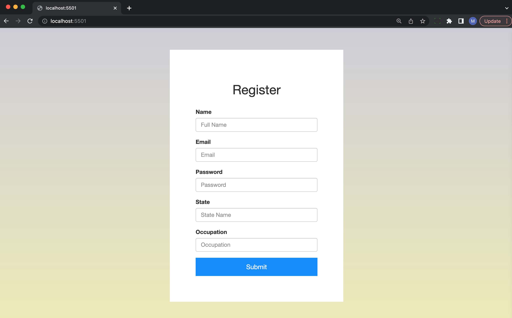

# fetch-rewards-frontend-exercise

## About

This project is a simple web page with a form to create a new user

## Tecnologies Used
  - JavaScript
  - HTML
  - CSS
  - AJAX
  - Boostrap

## Features

  - Allows a user to complete and submit the form
  - Prevent submission of form until all fields have valid values
  - Provides feedback upon successful form submission
  - Autocompletion on state and occupation field

## How to run
  1) clone repository, or download zip file and extract
  2) open project on any app with live serving capabilities

  
